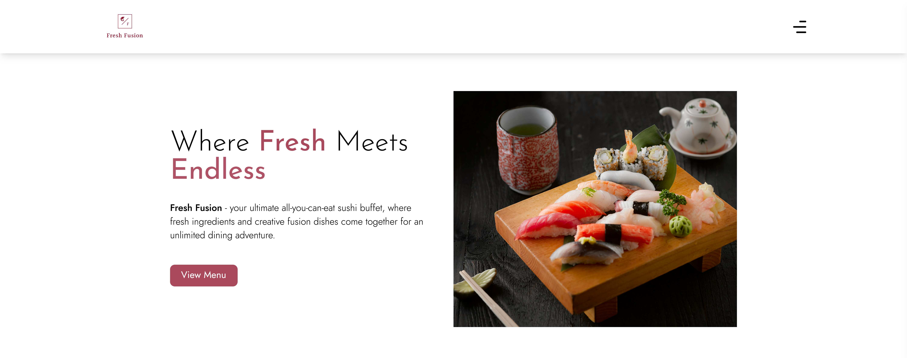
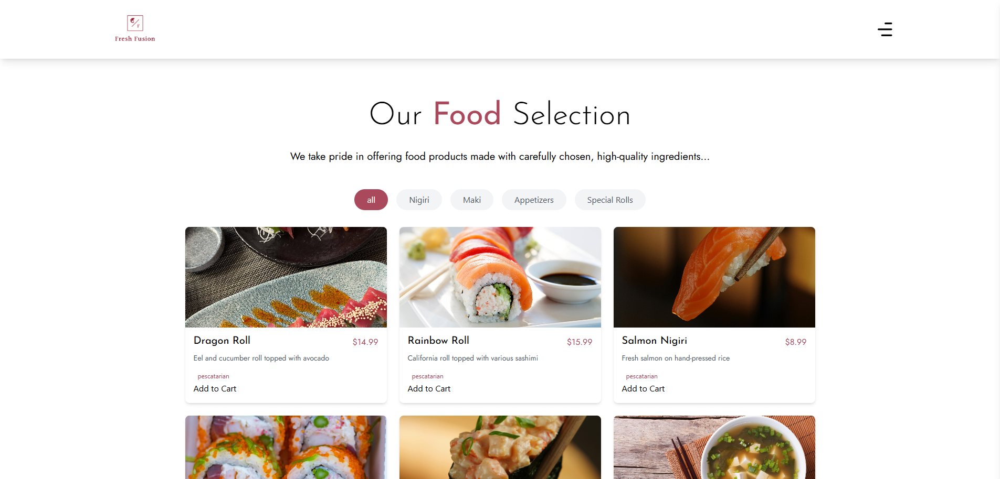

# Fresh Fusion - Full-stack Sushi Restaurant Website

**Fresh Fusion** is a full-stack sushi restaurant website designed to provide an intuitive and seamless experience for users to browse the menu, place orders, and interact with the restaurant system. The project includes both frontend and backend components, implemented using modern web technologies.  

---

## 🚀 **Features**

- **Responsive Design**: Mobile-first approach, ensuring a great user experience across all devices.
- **Menu Browsing**: Users can browse different sushi items, view details, and place orders.
- **Order Management**: Real-time order management with the backend system.
- **Authentication**: User login system for order history and profile management.
- **Smooth Animations**: Engaging UI animations using Framer Motion.
  
---

## 🧑‍💻 **Technology Stack**

- **Frontend**: React.js, Tailwind CSS, React Router, Framer Motion, React Icons  
- **Backend**: Node.js, Express.js, RESTful API  
- **Database**: MongoDB Atlas (for storing menu items, user profiles, and order data)  
- **Deployment**: Render (manual deployment and environment variable management)

---

## 🔧 **Getting Started**

To run this project locally, follow these steps:

### 1. **Clone the repository**

```bash
git clone https://github.com/lachesism0609/fresh-fusion.git
```

### 2. **Install dependencies**

Navigate to both the frontend and backend directories and install the dependencies:

For the frontend:
```bash
cd fresh-fusion
npm install
```

For the backend:
```bash
cd fresh-fusion-backend
npm install
```

### 3. **Run the project**

Frontend:
Navigate to the frontend folder and run:
```bash
npm start
```

Backend:
Navigate to the backend folder and run:
```bash
npm start
```

Now, you can open your browser and view the website at http://localhost:3000.

---

## 📸 **Screenshots**



---

## 🌍 **Live Demo**
You can view the live version of the project here:
[Live Demo - Fresh Fusion](https://lachesism0609.github.io/fresh-fusion)

---

## 📂 **Original Project Repository**
This project was originally created for a university course and can be accessed on the following GitLab repository:
[Original Project - Sushi Lover](https://gitlab.labranet.jamk.fi/AE8278/sushi-lover)

---

## 📝 **License**
This project is licensed under the MIT License - see the [LICENSE](./LICENSE) file for details.

---

## 🤝 **Contributing**
Feel free to fork this project and make improvements. If you want to contribute, you can create an issue or submit a pull request. Any feedback or suggestions are welcome!

---

## 📫 **Contact**
- [GitHub](https://github.com/lachesism0609)
- [LinkedIn](https://www.linkedin.com/in/lenap469/)

---

## 💡 **Next Steps / Future Improvements**
- Add more test coverage for backend API.
- Enhance authentication with OAuth (e.g., Google or Facebook login).
- Add more animations and interactions for a richer user experience.
- Optimize website performance through code splitting, lazy loading components, and image optimization.
